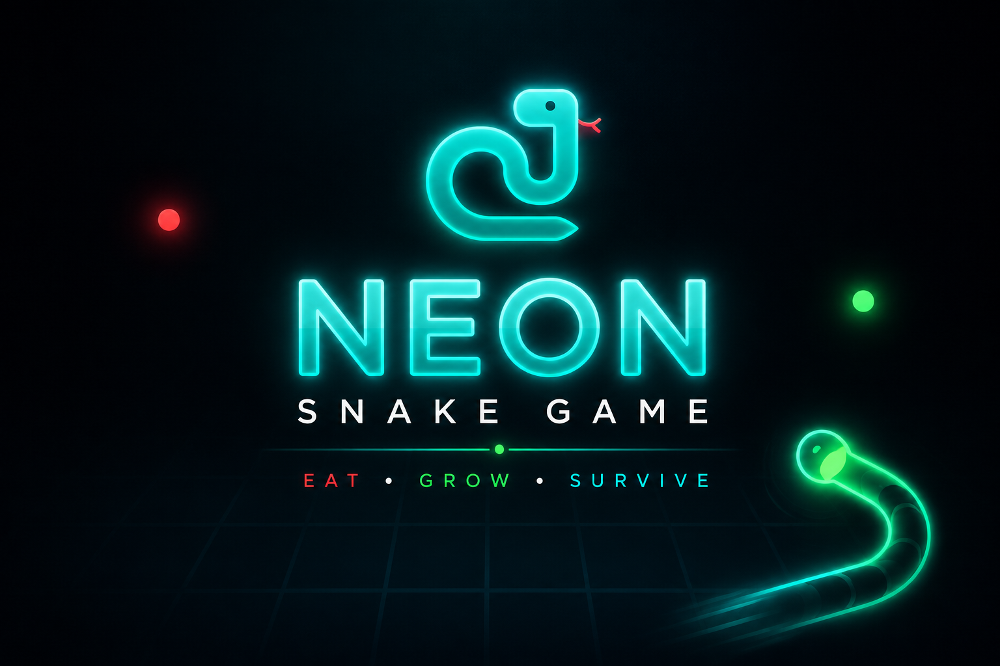

# 🐍 Neon Snake Game


A premium **Neon Snake Game** built with **HTML, CSS, and JavaScript**, combining classic Snake gameplay with a futuristic neon arcade interface, difficulty levels, high-score tracking, animations, and responsive design.

> **Chase the glow. Rule the grid.**

---

## 🎮 Live Demo

[🎮 Play Neon Snake Game](https://neonsnakegame-ainuldev.vercel.app/) 

---

## ✨ Features

* 🐍 Classic Snake gameplay
* 💎 Premium neon arcade interface
* 🌌 Animated futuristic background
* 🎮 Easy, Medium & Hard difficulty
* ⏸️ Pause / Resume controls
* 🔄 Restart & Play Again
* 🏆 High-score tracking with `localStorage`
* 🔥 Animated neon food orb
* 👀 Direction-aware snake eyes
* 💀 Premium Game Over screen
* ⌨️ Keyboard controls
* 📱 Responsive design
* 🎨 Glassmorphism & glow effects
* 🚀 Vercel-ready deployment

---

## 🖼️ Preview



---

## 🕹️ How to Play

Use the **Arrow Keys** to control the snake and collect glowing food to increase your score.

| Key         | Action         |
| ----------- | -------------- |
| ⬆️ ⬇️ ⬅️ ➡️ | Move Snake     |
| `Space`     | Pause / Resume |
| `R`         | Restart        |

Avoid hitting the **walls** or the **snake's own body**.

---

## ⚡ Difficulty

* 🟢 **Easy** — Speed `8`
* 🟡 **Medium** — Speed `12`
* 🔴 **Hard** — Speed `18`

---

## 🛠️ Technologies

* HTML5
* CSS3
* JavaScript
* HTML Canvas API
* Browser Local Storage
* Google Fonts
* Vercel

No frameworks or external JavaScript libraries are required.

---

## 📂 Project Structure

```text
Neon-Snake-Game/
│
├── index.html
├── style.css
├── script.js
├── README.md
└── screenshot.png
```

---

## 🎨 Design

The game combines a futuristic arcade aesthetic with premium styling:

* Cyan, emerald & royal-gold neon effects
* Glassmorphism panels
* Animated backgrounds and particles
* Glowing snake and food effects
* Premium HUD and overlays
* Smooth transitions and animations

---

## 🏆 High Score

Your best score is automatically saved using:

```javascript
localStorage
```

The score remains available after refreshing or reopening the game unless browser storage is cleared.

---

## 📊 Game Status

The HUD displays the current game state:

```text
READY
PLAYING
PAUSED
GAME OVER
```

---

## 📱 Responsive Design

Designed to work across:

* Desktop
* Laptop
* Tablet
* Mobile

For the best experience, use a modern browser such as Chrome, Edge, Firefox, Safari, or Opera.

---

## 🔮 Future Improvements

Planned ideas include:

* 🔊 Music & sound effects
* 📱 Mobile swipe controls
* ⚡ Power-ups
* 🏅 Achievements & levels
* 🎨 Snake skins and themes
* 🏆 Global leaderboard
* 🎮 Gamepad support
* 🌐 Online multiplayer
* ⏱️ Time Attack & Challenge modes

---

## 👨‍💻 Developer

**Developed & Created by Ainul Haq**

A modern reinterpretation of the classic Snake Game with a premium neon arcade experience.

---

## 📜 Copyright

```text
© 2026 Neon Snake Game. All Rights Reserved.
```

---

## ⭐ Support

If you like the project, consider giving the GitHub repository a ⭐ to support future improvements.

---

# 🐍 Neon Snake Game

### Chase the glow. Rule the grid.

**Developed & Created by Ainul Haq**

---

## ⚙️ Installation & Usage

1. Clone the repo:

```bash
git clone https://github.com/ainulhaqsde/Neon-Snake-Game.git
```

2. Open the project folder:

```bash
cd Neon-Snake-Game
```

3. Open `index.html` directly in your browser or run it using **Live Server** in Visual Studio Code.
